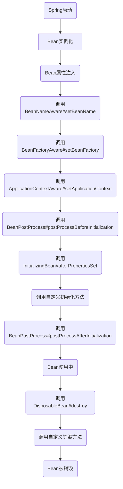

框架涉及思路

从领域的角度来看spring，基本都是围绕着BeanDefinition 进行操作.

## Spring Bean生命周期



``
StartSpring --> BeanInstantiation --> BeanFieldSet --> BeanNameAware BeanNameAware-->BeanFactoryAware-->ApplicationContextAware-->BeforeBeanPostProcess BeforeBeanPostProcess-->InitializaingBean-->BeanSelfInit-->AfterBeanPostProcess AfterBeanPostProcess-->UsingBean UsingBean-->CloseBean-->DestroySelfFunc-->EndBean
``

核心理解:
1 核心在于BeanFactory#getBean. 剩余的都是在createBean的路上狂奔.

# source handler
## BeanFactory基础构成关系
```text
BeanFactory 最顶级类。定义IOC对外最基础接口
HierarchicalBeanFactory 额外封装了一层接口类，spring框架是提供了getParentBeanFactory&containsLocalBean两个接口，但本质没有额外增加处理逻辑
ListableBeanFactory  获取指定类型的所有实例， 对IOC统一对外二次封装
AutowireCapableBeanFactory 自动注入顶级接口。提供自动注入的一些基础接口

SingletonBeanRegistry 单例Bean最顶级类。定义单例相关基础接口
ConfiguratableBeanFactory 结合BeanFactory和SingletonBeanRegistry 提供convertService, BeanPostProcesser等加载功能


ConfigurableListableBeanFactory 组合IOC对外接口，以及单例对外操作的接口。

总结: 其实主要分为两条线
```
## 顶级接口基础实现.
### 实现路径

public class DefaultSingletonBeanRegistry implements SingletonBeanRegistry
public abstract class AbstractBeanFactory extends DefaultSingletonBeanRegistry implements ConfigurableBeanFactory
public abstract class AbstractAutowireCapableBeanFactory extends AbstractBeanFactory implements AutowireCapableBeanFactory
public class DefaultListableBeanFactory extends AbstractAutowireCapableBeanFactory implements ConfigurableListableBeanFactory, BeanDefinitionRegistry


v1 基本的要求 IOC 基本的容器管理

- 类加载
- 有参构造函数bean
- 解决循环依赖.
- 思考触发点是从bean正常的生命周期走.

V2 要求
- 